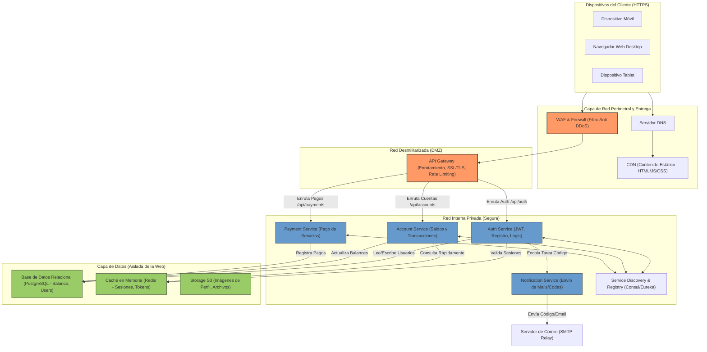

# Diseño de Infraestructura y Red - Digital Money House

Este documento detalla la arquitectura de infraestructura recomendada, las herramientas de virtualización y el diseño de la red lógica para soportar el ecosistema de microservicios de **Digital Money House**.

---

## 1. Herramientas Recomendadas y Justificación

### Git (Control de Versiones)
- **Rol:** Repositorio centralizado para el código fuente de todos los microservicios y del frontend.
- **Uso:** Implementación de flujos de trabajo (GitFlow o Trunk-Based Development) para la integración y despliegue continuo (CI/CD) mediante GitHub Actions o GitLab CI.

### Docker (Contenedores)
- **Rol:** Empaquetamiento y estandarización del entorno de ejecución de cada microservicio.
- **Uso:** Uso de `Dockerfile` para construir imágenes inmutables de cada servicio y `docker-compose.yml` para levantar la infraestructura completa localmente de forma uniforme en entornos de desarrollo y pruebas.

### Kubernetes / Docker Swarm (Orquestación de Microservicios)
- **Rol:** Gestión del ciclo de vida, escalabilidad, balanceo de carga y tolerancia a fallos de los contenedores en producción.

---

## 2. Boceto de la Red y sus Componentes (Arquitectura Lógica)

El siguiente diagrama en bloques describe el flujo de comunicación desde el cliente (navegador web o app móvil) a través de las capas de seguridad, enrutamiento y los microservicios individuales hasta la capa de datos.

---

## 3. Descripción de los Componentes y Flujos de Datos

1. **Clientes:** Acceden a la aplicación. Las peticiones estáticas son servidas directamente por un **CDN** (Content Delivery Network) para reducir latencia.
2. **WAF (Web Application Firewall):** Filtra el tráfico web malicioso (inyección SQL, XSS) y ataques DDoS.
3. **API Gateway:** Único punto de entrada para todas las APIs dinámicas. Se encarga de terminar la conexión SSL, enrutar las solicitudes al microservicio correspondiente basado en el prefijo de la ruta, aplicar políticas de *Rate Limiting* (límite de peticiones) y validar las firmas de tokens de autenticación JWT.
4. **Red Privada Interna (Segura):** Los microservicios no están expuestos directamente a Internet. Se comunican entre sí utilizando protocolos ligeros (REST, gRPC) y registran sus instancias en un servidor de **Service Discovery** (Consul/Eureka).
5. **Capa de Base de Datos:** 
   - **PostgreSQL / MySQL:** Almacena la información transaccional e histórica con alta consistencia de forma segura.
   - **Redis (Caché):** Almacena tokens temporales de verificación, sesiones e información consultada frecuentemente para acelerar los tiempos de respuesta.
   - **Object Storage (S3):** Para almacenar de forma eficiente imágenes estáticas y assets subidos por usuarios.
